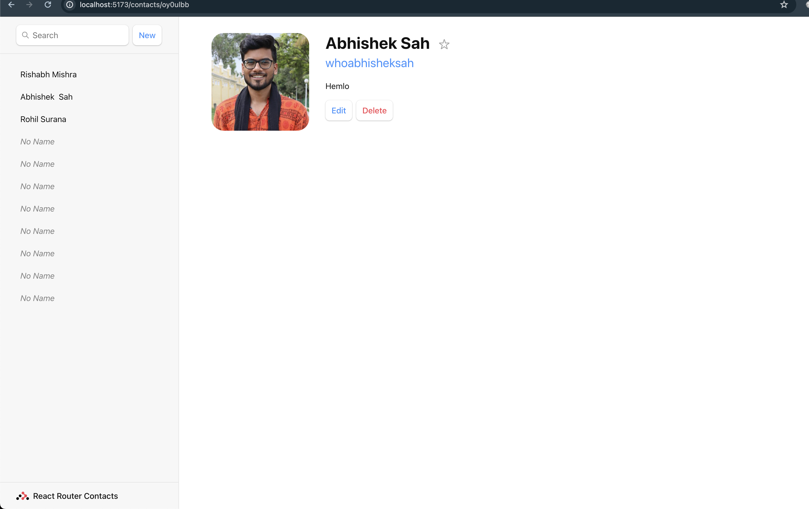

# RR-hadson

Geting hands on with react router.

## Setup

### Pre-req
1. Node v18.16.0
2. Npm 9.5.1

### Install deps
1. Install deps: `npm run i`
2. Run App : `npm run dev`

The page should look like this: 

### Build tools
1. Check fmt errors: `npm run fmt`
2. Fix fmt errors: `npm run fmt-fix`
3. Check lint errors: `npm run lint`
4. Fix lint errors: `npm run lint -- --fix`
